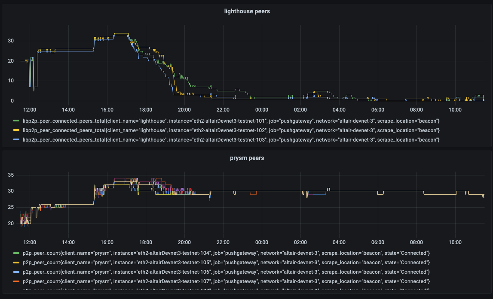

# Debugging an eth2 devnet  

Ethereum consensus layer or more popularly known as eth2 is an upgrade to the Ethereum aiming at a switch from PoW to PoS
consensus. The eth2 phase 0 launch has been successful so far and the Beacon chain has been functional for almost 9 months.
The eth2 community is now actively working on the `altair` hard fork, the first protocol update for the eth2 network. In 
preparation for this hard fork there have been multiple `devnets` to test for bugs. 

`altair-devnet-3` is the fourth devnet spun up with the express intent to test client compatibility and catch any 
issues before a larger public testnet. The specs for the devnet can be found [here](https://github.com/eth2-clients/eth2-networks/tree/master/shared/altair-devnet-3).
The devnet had a rocky start due to improper configs by some participant, the issue was found quite quickly and the devnet
started to finalize. The altair hardfork was successfully completed and the devnet continued as expected. The attestation
rates were relatively good and sync aggregate participation rates were hovering around the 95% mark. The devnet had worked
as expected and things seemed good. The rest of the blogpost purely refers to steps used in debugging and not the actual
fixe itself. 

Metrics and logs seemed to indicate something was wrong though. First step was to check the logs - the lighthouse nodes
seem to have lost all their peers and were at roughly 3 peers. The next step was to check the metrics to see what the timeline
looked like. I logged into Grafana and created a quick dashboard that logged peers per client. The metrics clearly showed
 that the lighthouse client was leaking peers slowly. That tells us that there was no issue with the hardfork leading to a
sharp drop in peers. It additionally tells us that the peer score was slowly being reduced until the lighthouse node banned 
the peer.  

    

Armed with this information, I restarted the nodes with `debug` logging enabled to get more information about peer scoring. 
Since debug logs can be extremely overwhelming, some `grep-fu` was required. Since we don't have an exact log line we are looking
for, general grepping of terms such as `voted`, `invalid` and `downvoted` would make sense.   

I ran `docker logs beacon 2>&1 | grep "invalid"` and most results were related to `PastSlots` indicating a high latency to 
other peers and receiving slots too late. But there was one log message in particular that was interesting:  
```
DEBG Invalid sync committee message from network, type: "sync_contribution", peer_id: 16Uiu2HAmP4jDeYxvVkVizndoYksJYZvpCkgSrWxeHEL5qj4tsTtk, reason: InvalidSignature
```  

Now we had an invalid signature (bad thing) and a peerID to hunt down. The lighthouse API endpoint allows us to get all the 
peers of that node along with metadata about the client and the IP address. The standard endpoint is `/eth/v1/beacon/peers`, 
but lighthouse also provides us with `/lighthouse/peers` that contains more metadata. Since the response would be a wall of json,
we use `jq` to make it look pretty and `grep` to fetch the corresponding peer. Grep allows us to get the lines above and below
the matched line, allowing us to get the entire json body.  

Running `curl localhost:4000/lighthouse/peers | jq | grep -B 1 -A 52 "16Uiu2HAmP4jDeYxvVkVizndoYksJYZvpCkgSrWxeHEL5qj4tsTtk"` 
gives us the information about the peer. The response looks like this:
```json
  {
    "peer_id": "16Uiu2HAmP4jDeYxvVkVizndoYksJYZvpCkgSrWxeHEL5qj4tsTtk",
    "peer_info": {
      "_status": "Healthy",
      "score": {
        "Real": {
          "lighthouse_score": -58.15072332402626,
          "gossipsub_score": 8.653623324336476,
          "ignore_negative_gossipsub_score": false,
          "score": -58.14044714632861
        }
      },
      "client": {
        "kind": "Nimbus",
        "version": "unknown",
        "os_version": "unknown",
        "protocol_version": "ipfs/0.1.0",
        "agent_string": "nimbus"
      },
      "connection_status": {
        "status": "banned",
        "connections_in": 0,
        "connections_out": 0,
        "last_seen": 23148
      },...
```

That tells us the peer in question that produced the invalid signature is a nimbus client and it was banned by lighthouse due 
to its poor score. 

Since the devnet is a multiclient testnet, we should be able to see what the other clients think of this peer. So I SSH-ed into 
an instance containing a prysm instance and checked the logs for this peer. I switched prysm to `debug` logging as well and 
ran `docker logs beacon 2>&1 | grep "16Uiu2HAmP4jDeYxvVkVizndoYksJYZvpCkgSrWxeHEL5qj4tsTtk"`. The logs however indicate no
issues. Prysm simply listed one log message when it connected to the peer and there were no other entries about the peer.  

The information was passed on to the respective client teams along with access to the logs. They are now investigating the issue further. 
Since this is not a critical issue and hasn't stopped the chain from finalizing, it would be treated as something that needs a patch. I 
will try my best to update this blogpost in the future with the final outcome.  